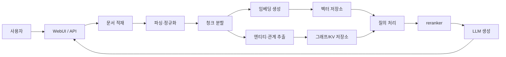
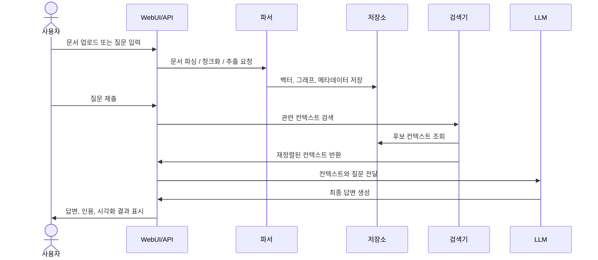

# 프로젝트 소개

LightRAG는 문서를 넣으면 지식을 구조화해 저장하고, 질문이 들어오면 벡터 검색과 그래프 탐색을 함께 써서 답하는 RAG 프레임워크다. WebUI, API, Docker, Kubernetes, 오프라인 배포까지 함께 제공되므로, 단순한 데모보다 실제 운영을 염두에 둔 저장소에 가깝다.

> [!summary] 한 줄 요약
> LightRAG는 문서를 넣으면 지식을 구조화해 저장하고, 질문이 들어오면 벡터 검색과 그래프 탐색을 함께 써서 답하는 RAG 프레임워크다. WebUI, API, Docker, Kubernetes, 오프라인 배포까지 함께 제공되므로, 단순한 데모보다 실제 운영을 염두에 둔 저장소에 가깝다. ^core-summary

> [!info] 읽기 가이드
> - 먼저 `빠른 시작`, `폴더 구조`, `실행 흐름`을 확인
> - 추정 또는 확인 필요 표시는 저장소 구조 기준 판단[^github-inference]

## 한눈에 보는 핵심 포인트

- Python 3.10+ 기반의 RAG 시스템이다.
- 문서 적재와 질의 응답이 같은 지식 저장 구조를 공유한다.
- 벡터 저장소, 그래프 저장소, KV/JSON 계층을 함께 활용한다.
- WebUI와 API 서버가 같이 제공된다.
- `uv` 중심의 패키지 관리가 권장된다.
- Docker Compose와 Kubernetes 배포 구성이 있다.
- 오프라인/에어갭 설치 경로도 고려되어 있다.
- MIT 라이선스다.

## 무엇을 하는 저장소인가

- 문서, 텍스트, 일부 멀티모달 자료를 받아 검색 가능한 지식 기반으로 바꾼다.
- 긴 문서를 청크로 나누고, 임베딩과 엔티티·관계 추출을 수행한다.
- 추출한 정보를 지식 그래프와 벡터 저장소에 함께 저장한다.
- 질문이 들어오면 관련 컨텍스트를 찾고, reranker로 후보를 재정렬한 뒤 LLM 답변을 만든다.
- 출처 추적, 인용, 시각화, 평가/추적 기능을 확장할 수 있다.
- 저장소 설명과 파일 구성상, 배포 방식에 따라 여러 백엔드와 연결되는 구조로 보인다.

## 빠른 시작

1. 준비 환경을 맞춘다.  
   Python 3.10 이상이 필요하고, 패키지 관리는 `uv`가 권장된다. WebUI를 빌드하려면 `bun`도 필요하다.

2. 로컬에서 실행한다.
```bash
git clone https://github.com/HKUDS/LightRAG.git
cd LightRAG
make dev
cp env.example .env
lightrag-server
```
`make dev`는 개발용 의존성, 오프라인 스택, 프런트엔드 빌드를 함께 준비하는 경로다. 실제 실행 전에는 `.env`와 `config.ini`에 LLM, 임베딩, 저장소 설정을 채워야 한다. 확인 필요: 어떤 백엔드를 쓸지는 배포 환경에 따라 달라진다.

3. Docker로 실행한다.
```bash
git clone https://github.com/HKUDS/LightRAG.git
cd LightRAG
cp env.example .env
docker compose up
```
Compose 방식은 `Dockerfile`과 `docker-compose.yml`을 사용한다. `config.ini`와 `.env`가 마운트되므로 두 설정 파일이 필요하다.

## 폴더 구조

- `lightrag/`: 메인 파이썬 패키지다. API 서버와 도구가 들어있는 것으로 보인다. 세부 하위 모듈은 확인 필요이다.
- `lightrag_webui/`: 웹 UI 프런트엔드다. README와 Dockerfile 기준으로 Bun으로 빌드된다.
- `docs/`: 설치, 오프라인 배포, 인터랙티브 설정 문서가 있다.
- `examples/`: 사용 예제와 샘플 코드가 있다.
- `k8s-deploy/`: Kubernetes 배포 리소스가 있다.
- `assets/`, `README.assets/`: 로고, 다이어그램, 문서용 이미지가 있다.
- `.github/`: GitHub Actions와 저장소 운영 자동화가 있다.
- `config.ini.example`, `env.example`: 실행 설정 템플릿이다.
- `Dockerfile`, `Dockerfile.lite`, `docker-compose.yml`, `docker-compose-full.yml`: 컨테이너 빌드와 배포 구성을 담당한다.
- `AGENTS.md`, `CLAUDE.md`, `.clinerules`: 사람과 에이전트가 지켜야 할 작업 규칙이 들어 있다.

## 실행 흐름

- 사용자가 문서를 업로드하거나 API/WebUI에서 입력한다.
- 문서를 파싱하고 정규화한다.
- 텍스트를 청크로 나누고 임베딩을 만든다.
- 엔티티와 관계를 추출해 지식 그래프를 만든다.
- 벡터 저장소, 그래프 저장소, KV/JSON 저장소에 분산 저장한다.
- 질문이 들어오면 관련 컨텍스트를 검색하고 reranker로 재정렬한다.
- 선택된 컨텍스트를 LLM에 넣어 최종 답변을 생성한다.
- WebUI/API로 답변, 인용, 시각화 결과를 반환한다.
- 추정: 저장소 조합은 OpenSearch, Neo4j, MongoDB, PostgreSQL, Qdrant, Milvus, Redis 같은 백엔드와 연결될 수 있다.

## 기술 스택

- 언어: Python 3.10+.
- 패키지 관리: `uv`, 선택적으로 `pip`.
- 서버: `FastAPI`, `aiohttp`, `uvicorn`, `gunicorn`.
- 데이터 처리: `numpy`, `pandas`, `networkx`, `tiktoken`, `xlsxwriter`.
- 모델 연동: `openai`, `google-genai`, `anthropic`, `ollama`, `voyageai`, `zhipuai`, `llama-index`.
- 저장소: `redis`, `neo4j`, `pymongo`, `asyncpg`, `pgvector`, `qdrant-client`, `pymilvus`, `opensearch-py`.
- 문서 처리: `openpyxl`, `python-docx`, `python-pptx`, `pypdf`, `pycryptodome`, `docling`.
- 평가/추적: `ragas`, `langfuse`.
- 프런트엔드 빌드: `bun`.
- 배포: `Docker`, `docker compose`, `Kubernetes`.

## 먼저 읽을 파일

- `README.md`: 전체 컨셉, 설치, 배포, 주요 기능을 한 번에 볼 수 있다.
- `pyproject.toml`: 핵심 의존성, optional extras, 실행 스크립트를 확인할 수 있다.
- `env.example`: 어떤 환경 변수를 채워야 하는지 알 수 있다.
- `config.ini.example`: 서버와 저장소 관련 기본 설정을 확인하기 좋다.
- `docs/InteractiveSetup.md`: 설정 wizard와 환경 구성 흐름을 설명한다.
- `docs/OfflineDeployment.md`: 네트워크가 제한된 환경에서의 설치 방법을 다룬다.
- `lightrag/api/lightrag_server.py`: 서버 진입점을 이해하는 데 가장 직접적이다.
- `lightrag_webui/`: 웹 UI가 어떻게 빌드되는지 확인할 수 있다.
- `Makefile`: `make dev`, `make env-base`, `make env-storage`, `make env-server` 같은 운영 흐름을 잡는 데 중요하다.
- `AGENTS.md`, `CLAUDE.md`: 저장소 운영 규칙을 따라야 하는 경우 먼저 확인하는 편이 좋다.

## 용어 사전

- RAG: 검색으로 찾은 근거를 LLM 입력에 섞어 답변하는 방식이다.
- Retrieval: 질문과 관련 있는 문서 조각이나 그래프 정보를 찾는 단계다.
- Embedding: 텍스트를 벡터로 바꿔 유사도 검색이 가능하게 만드는 표현이다.
- Chunk: 긴 문서를 검색하기 좋은 단위로 나눈 조각이다.
- Knowledge Graph(KG): 엔티티와 관계를 그래프 형태로 저장한 지식 구조다.
- Reranker: 검색 후보들의 순서를 다시 매겨 더 관련성 높은 항목을 앞에 두는 모델이다.
- Storage backend: LightRAG가 데이터를 저장하는 실제 DB나 저장 시스템이다.
- WebUI: 브라우저에서 문서 넣기, 검색, 시각화를 할 수 있는 화면이다.
- Citation: 답변이 어떤 근거에서 나왔는지 출처를 붙여 추적 가능하게 하는 기능이다.
- Multimodal: 텍스트 외에 이미지, 표, 수식 같은 여러 형식을 함께 다루는 처리 방식이다.

## Mermaid 다이어그램

### 전체 구성



### 인덱싱과 질의 흐름




## 컬렉션 연결
- [[github-summaries|GitHub Summaries]] ^collection-links
- [[github-summaries/2026|2026 아카이브]]
- [[github-summaries/2026/2026-04|2026-04 모음]]
- [[tags/python|#python]]

[^github-inference]: README, docs, manifest, key files, CI 파일 기준 자동/수동 혼합 정리. 실제 실행 검증은 별도로 확인해야 한다.
