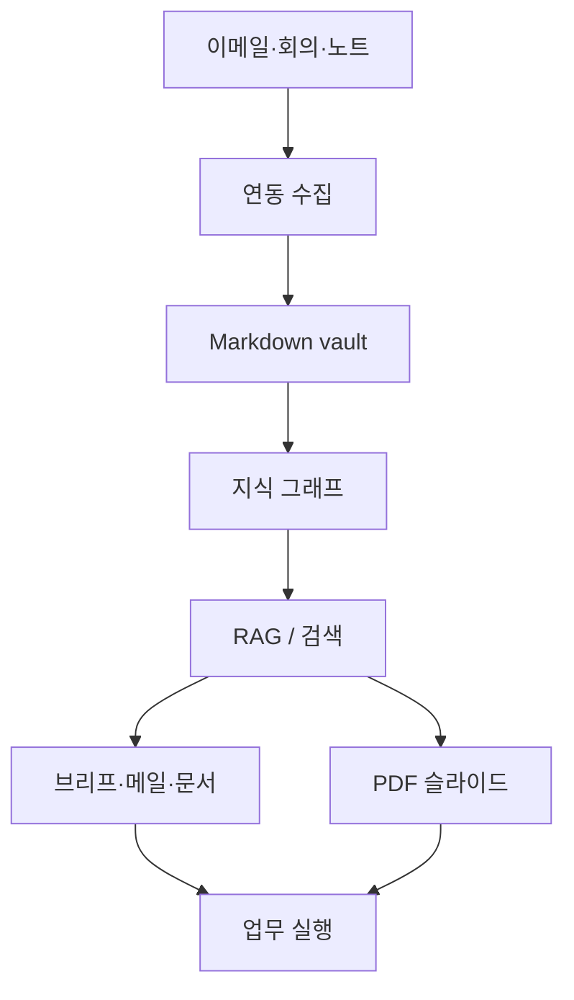
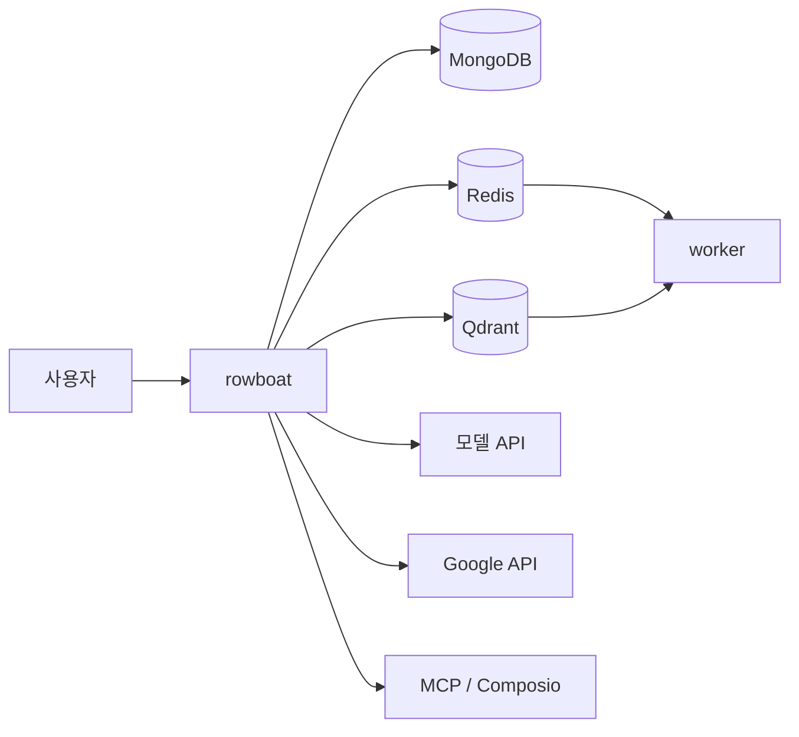

# 프로젝트 소개

[rowboatlabs/rowboat](https://github.com/rowboatlabs/rowboat)

<kbd>Stars</kbd> 10686 · <kbd>Forks</kbd> 972 · <kbd>License</kbd> Apache-2.0 · <kbd>Primary Language</kbd> TypeScript

로컬 Markdown 지식 그래프를 바탕으로 이메일, 회의, 노트, 외부 도구를 연결해 실제 업무 결과물을 만드는 AI 코워커 저장소다.

> [!summary] 한 줄 요약
> [rowboatlabs/rowboat](https://github.com/rowboatlabs/rowboat)

<kbd>Stars</kbd> 10686 · <kbd>Forks</kbd> 972 · <kbd>License</kbd> Apache-2.0 · <kbd>Primary Language</kbd> TypeScript

로컬 Markdown 지식 그래프를 바탕으로 이메일, 회의, 노트, 외부 도구를 연결해 실제 업무 결과물을 만드는 AI 코워커 저장소다. ^core-summary

> [!info] 읽기 가이드
> - 먼저 `빠른 시작`, `폴더 구조`, `실행 흐름`을 확인
> - 추정 또는 확인 필요 표시는 저장소 구조 기준 판단[^github-inference]

## 한눈에 보는 핵심 포인트

| 포인트 | 메모 |
|---|---|
| 기억 중심 설계 | 사람, 프로젝트, 결정, 약속을 장기적으로 누적 |
| 로컬 우선 저장 | Markdown vault 기반, 편집 가능, 백링크 지원 |
| 실무 출력 지향 | 브리프, 이메일, 문서, PDF 슬라이드 생성 |
| 연동 범위 넓음 | Gmail, Calendar, Drive, Fireflies, Exa, MCP, Composio |
| 선택 기능 풍부 | 음성 입력/출력, 웹 검색, 외부 도구 확장 |

## 무엇을 하는 저장소인가

| 층 | 역할 | 해석 |
|---|---|---|
| 입력 | 이메일, 캘린더, 회의 노트, 음성 메모 | 업무 맥락 수집 |
| 저장 | Obsidian 호환 Markdown vault | 사람이 직접 읽고 수정 가능한 기억 저장소 |
| 연결 | 백링크, 관계 정보 | 사람-프로젝트-결정 연결 |
| 탐색 | Qdrant, RAG | 필요한 맥락 재검색 |
| 실행 | 문서, 메일, 브리프, 슬라이드 생성 | 실제 산출물 생산 |
| 확장 | MCP, Composio | 외부 SaaS, 내부 도구 연결 |

핵심 메모:
- "메모 앱"보다 "업무용 기억 시스템"에 가까움
- 기억이 모델 내부가 아니라 파일 형태로 남음
- 자동 요약보다 관계 보존이 더 중심
- 결과물 생성과 업무 실행까지 이어짐

## 빠른 시작

| 단계 | 작업 | 메모 |
|---|---|---|
| 1 | 공식 다운로드 페이지에서 최신 설치 파일 받기 | macOS, Windows, Linux 지원 |
| 2 | `.env.example`를 기준으로 환경 변수 준비 | OpenAI, DB, 도구 키 포함 |
| 3 | Google 연동이 필요하면 `google-setup.md` 확인 | Gmail, Calendar, Drive |
| 4 | 선택 기능용 API 키 파일 배치 | `~/.rowboat/config/*.json` |
| 5 | 컨테이너로 실행 | `docker-compose.yml` 기준, 세부 커맨드는 `확인 필요` |
| 6 | 앱에서 메일, 회의, 노트 연결 | 지식 그래프 축적 시작 |

선택 기능 파일 예시:
| 기능 | 파일 |
|---|---|
| 음성 입력 | `~/.rowboat/config/deepgram.json` |
| 음성 출력 | `~/.rowboat/config/elevenlabs.json` |
| 웹 검색 | `~/.rowboat/config/exa-search.json` |
| 외부 도구 | `~/.rowboat/config/composio.json` |

공통 형식:
```json
{"apiKey":"<key>"}
```

주의:
- `docker-compose.yml`에 `rowboat`, `mongo`, `redis`, `qdrant`, `rag-worker`, `jobs-worker`가 확인됨
- `rowboat_agents`, `copilot`, `chat_widget` 등은 주석 처리 상태
- 정확한 로컬 진입 명령은 스냅샷에 없어서 `확인 필요`

## 폴더 구조

| 경로 | 역할 | 메모 |
|---|---|---|
| `README.md` | 프로젝트 개요와 설치 안내 | 가장 먼저 볼 문서 |
| `.env.example` | 환경 변수 샘플 | 실행 전 기준점 |
| `docker-compose.yml` | 로컬 서비스 구성 | Mongo, Redis, Qdrant 포함 |
| `google-setup.md` | Google 연동 가이드 | Gmail, Calendar, Drive 연결 |
| `start.sh` | 시작 스크립트 | 실제 진입점 후보 |
| `build-electron.sh` | 데스크톱 빌드 스크립트 | Electron 계열 패키징 `추정` |
| `Dockerfile.qdrant` | Qdrant용 Docker 정의 | 벡터 저장소 초기화용 `추정` |
| `CLAUDE.md` | 작업 규칙/운영 메모 | 내용은 `확인 필요` |
| `LICENSE` | Apache-2.0 라이선스 | 배포 조건 확인용 |
| `.github/` | CI 및 워크플로 | 자동화 설정 |
| `apps/` | 실제 애플리케이션 묶음 | 하위 구조는 일부 `추정` |
| `apps/rowboat` | 본체 앱 | `docker-compose.yml` 빌드 대상 |
| `apps/docs` | 문서 사이트 | `docker-compose.yml` 빌드 대상 |
| `apps/experimental/*` | 실험 서비스 | 주석 처리된 서비스 기준 `추정` |
| `assets/` | 정적 리소스 | 로고, 이미지 등 `추정` |

## 실행 흐름

| 단계 | 흐름 | 관련 구성 |
|---|---|---|
| 1 | 사용자 입력 수집 | 이메일, 회의 노트, 음성 메모 |
| 2 | 외부 연동 수집 | Gmail, Google Calendar, Drive, Fireflies |
| 3 | Markdown vault 갱신 | 사람이 읽을 수 있는 기억 누적 |
| 4 | 관계 연결 | 사람, 프로젝트, 결정, 약속 간 링크 생성 |
| 5 | 검색 및 재조합 | Qdrant, RAG |
| 6 | 결과 생성 | 브리프, 메일, 문서, PDF 슬라이드 |
| 7 | 외부 작업 실행 | MCP, Composio, 로컬 도구 |

운영 역할 메모:
- MongoDB: 상태와 영속 데이터
- Redis: 작업 큐와 백그라운드 처리
- Qdrant: 벡터 검색과 관련 문맥 검색
- `rag-worker`: 문서/파일 처리 계열 작업
- `jobs-worker`: 일반 작업 처리 계열 작업

## 기술 스택

| 범주 | 기술 | 역할 |
|---|---|---|
| 언어 | TypeScript | 본체 구현 |
| 실행/배포 | Docker, Docker Compose | 로컬 멀티 서비스 실행 |
| 저장소 | MongoDB | 영속 데이터 |
| 큐/캐시 | Redis | 비동기 작업 |
| 벡터 검색 | Qdrant | RAG 기반 검색 |
| AI 모델 | OpenAI API, Provider 설정 | 추론 엔진 |
| 로컬/호스티드 모델 | Ollama, LM Studio, 외부 모델 | 교체 가능한 모델 소스 |
| 연동 규격 | MCP | 외부 도구 연결 |
| 자동화 연동 | Composio | SaaS 도구 연결 |
| Google 연동 | Gmail, Calendar, Drive API | 업무 컨텍스트 수집 |
| 음성 | Deepgram, ElevenLabs | 입력/출력 음성 |
| 웹 검색 | Exa | 리서치 검색 |
| 데스크톱 패키징 | `build-electron.sh` 기준 Electron 계열 `추정` | 설치형 배포 |

## 먼저 읽을 파일

| 파일 | 이유 | 우선순위 |
|---|---|---|
| `README.md` | 프로젝트 목적, 기능, 설치 흐름 | 1 |
| `.env.example` | 필요한 환경 변수 목록 | 2 |
| `google-setup.md` | Google 서비스 연결 절차 | 3 |
| `docker-compose.yml` | 실제 실행 서비스와 의존성 | 4 |
| `start.sh` | 시작 방식 확인 | 5 |
| `CLAUDE.md` | 저장소 전용 작업 규칙 | 6 |
| `build-electron.sh` | 데스크톱 빌드 경로 | 7 |
| `Dockerfile.qdrant` | 벡터 저장소 준비 방식 | 8 |

## 용어 사전

| 용어 | 뜻 | 이 저장소에서의 의미 |
|---|---|---|
| local-first | 데이터가 로컬에 먼저 남는 방식 | 클라우드 종속 최소화 |
| knowledge graph | 관계 중심 지식 구조 | 사람, 프로젝트, 결정 연결 |
| vault | 노트 묶음 저장소 | Markdown 파일 집합 |
| backlinks | 역링크 | 노트 간 양방향 연결 |
| RAG | 검색 후 생성 | 관련 맥락을 먼저 찾고 답 생성 |
| MCP | 도구 연결 표준 | 외부 서비스 플러그인 연결 |
| live notes | 자동 갱신 노트 | `@rowboat`로 만드는 추적 노트 |
| Composio | 외부 SaaS 연동 계층 | API 키 기반 연결 |
| Fireflies | 회의 노트 서비스 | 회의 맥락 소스 |
| Obsidian-compatible | Obsidian과 호환되는 형식 | 일반 Markdown으로 관리 가능 |

## Mermaid 다이어그램





## 컬렉션 연결
- [[github-summaries|GitHub Summaries]] ^collection-links
- [[github-summaries/2026|2026 아카이브]]
- [[github-summaries/2026/2026-04|2026-04 모음]]
- [[tags/typescript|#typescript]]

[^github-inference]: README, docs, manifest, key files, CI 파일 기준 자동/수동 혼합 정리. 실제 실행 검증은 별도로 확인해야 한다.
