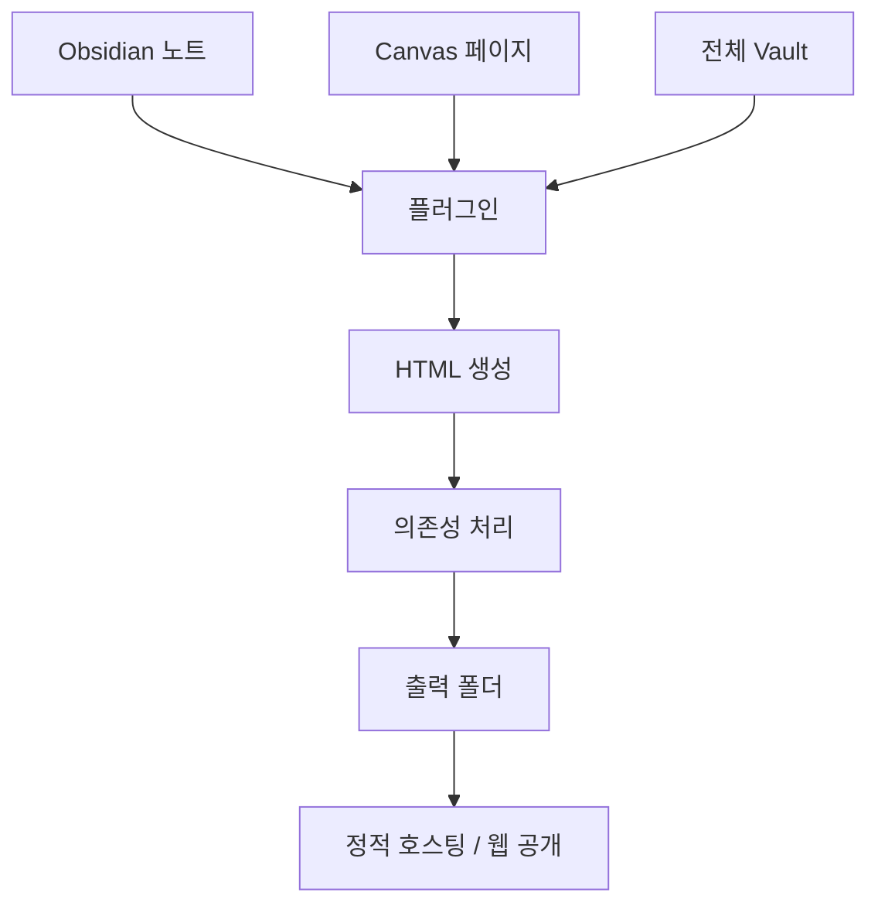
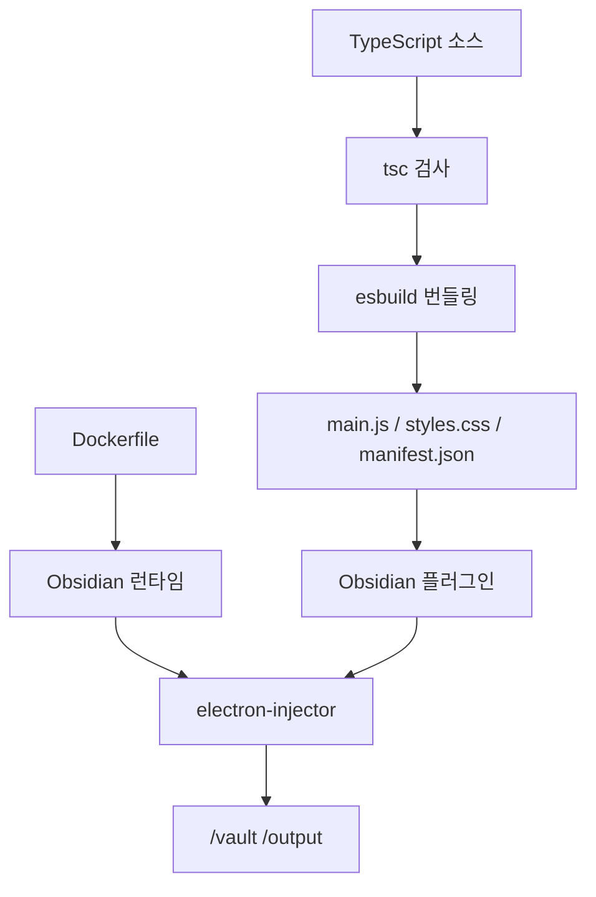

# 프로젝트 소개
[Repository](https://github.com/KosmosisDire/obsidian-webpage-export)  
공식 문서: [docs.obsidianweb.net](https://docs.obsidianweb.net/)  
`<kbd>Stars</kbd> 1275` `<kbd>Forks</kbd> 115` `<kbd>License</kbd> MIT` `<kbd>Primary Language</kbd> TypeScript`

> [!summary] 한 줄 요약
> Obsidian의 노트, Canvas, 전체 Vault를 웹용 HTML로 내보내는 플러그인. ^core-summary

> [!info] 읽기 가이드
> - 먼저 `빠른 시작`, `폴더 구조`, `실행 흐름`을 확인
> - 추정 또는 확인 필요 표시는 저장소 구조 기준 판단[^github-inference]

## 한눈에 보는 핵심 포인트

[KosmosisDire/obsidian-webpage-export](https://github.com/KosmosisDire/obsidian-webpage-export) · <kbd>Stars</kbd> 1275 · <kbd>Forks</kbd> 115 · <kbd>License</kbd> MIT · <kbd>Primary Language</kbd> TypeScript

| 항목 | 값 |
| --- | --- |
| 저장소 | KosmosisDire/obsidian-webpage-export |
| 기본 브랜치 | master |
| 주요 언어 | TypeScript |

| 항목 | 메모 |
|---|---|
| 목적 | Obsidian 콘텐츠를 정적 HTML로 변환 |
| 입력 범위 | 단일 파일, Canvas 페이지, 전체 Vault |
| 출력 성격 | 직접 접근 가능한 HTML 파일, 정적 호스팅 친화 |
| 강점 | 검색, 파일 트리, outline, graph, 테마 토글 |
| 호환성 | Dataview, Tasks 등 다수 플러그인 지원 |
| 배포 옵션 | 단일 파일 export, 일반 파일 분리 export 모두 지원 |
| 상태 | 기능은 동작, 다만 업데이트 변동 폭 큼 `README` 기준 |
| 활용처 | 디지털 가든, 개인 위키, 웹 공개용 노트 |

## 무엇을 하는 저장소인가
| 질문 | 답 |
|---|---|
| 이 저장소의 역할 | Obsidian 콘텐츠를 브라우저에서 읽는 HTML로 바꾸는 플러그인 |
| 해결하려는 문제 | 노트를 Obsidian 안에만 두지 않고, 웹으로 그대로 노출 |
| 핵심 가치 | 스타일 보존, 기능 보존, 배포 단순화 |
| 대상 콘텐츠 | 개별 문서, Canvas 페이지, 전체 Vault |
| 결과물 | HTML 본문 + 필요 시 의존성 파일 |
| 주의점 | 개발 중 프로젝트라 변경 폭과 버그 가능성 존재 |

## 빠른 시작
| 상황 | 절차 | 메모 |
|---|---|---|
| 일반 사용자 | Obsidian Community Plugins에서 설치 | `Open in Obsidian` 링크 사용 가능 |
| 수동 설치 | 최신 릴리스 zip 다운로드 → `{VaultFolder}/.obsidian/plugins/`에 압축 해제 → Obsidian 재시작 | Vault 기준 경로 |
| 베타 설치 | BRAT 설치 → 저장소 URL 등록 → Add Plugin | 베타 채널용 |
| 개발 준비 | `npm install` | `package-lock.json` 기준 |
| 개발 실행 | `npm run dev` | `node esbuild.config.mjs` |
| 배포 빌드 | `npm run build` | `tsc -noEmit -skipLibCheck && node esbuild.config.mjs production` |
| 버전 갱신 | `npm run version` | `manifest.json`, `versions.json` 갱신 |
| 컨테이너 경로 | `Dockerfile` 기반 이미지 빌드 | `docker-compose.yaml` 세부는 확인 필요 |

## 폴더 구조
| 구역 | 대표 파일 | 역할 |
|---|---|---|
| 루트 설정 | `package.json`, `tsconfig.json`, `eslint.config.mjs`, `esbuild.config.mjs` | 빌드, 검사, 번들링 |
| 소스 | `src/` | 핵심 TypeScript 구현 |
| 스타일/메타 | `styles.css`, `manifest.json`, `manifest-beta.json`, `versions.json` | 플러그인 스타일과 배포 메타 |
| 문서 | `README.md`, `docs/` | 사용자 안내, 개발/배포 문서 |
| 테스트 | `tests/` | 유틸, 파이프라인, 렌더러, 배포 검증 |
| 자동화 | `scripts/`, `.github/`, `action.yml` | 품질 검사, CI, 릴리스 보조 |
| 템플릿 | `templates/summary_templates.json` | 요약 템플릿 데이터 |
| 컨테이너 | `Dockerfile`, `docker-compose.yaml`, `docker/` | Docker 기반 실행 경로 |
| 라이선스 | `LICENSE` | MIT 라이선스 본문 |

## 실행 흐름
| 단계 | 흐름 | 결과 |
|---|---|---|
| 1 | Obsidian 입력 선택 | 단일 파일, Canvas, 전체 Vault |
| 2 | 문서와 메타데이터 수집 | 본문, 탐색, outline, graph 재료 |
| 3 | HTML 렌더링 | 웹용 구조 생성 |
| 4 | 스타일과 의존성 처리 | 분리 파일 또는 단일 파일 export |
| 5 | 출력 저장 | 정적 호스팅 가능한 HTML 생성 |
| 6 | 웹 공개 | 직접 접근 가능한 페이지로 배포 |

| 단계 | 빌드/배포 흐름 | 결과 |
|---|---|---|
| 1 | TypeScript 검사 | 타입 오류 사전 차단 |
| 2 | esbuild 번들링 | 플러그인 산출물 생성 |
| 3 | Obsidian 로드 | `main.js`, `styles.css`, `manifest.json` 사용 |
| 4 | Docker 경로 | Obsidian 다운로드 후 `electron-injector`로 플러그인 주입 |
| 5 | 런타임 볼륨 | `/vault`, `/output`, `/config.json` 사용 |

## 기술 스택
| 계층 | 기술 | 역할 | 메모 |
|---|---|---|---|
| 언어 | TypeScript | 핵심 구현 언어 | 확인됨 |
| 번들러 | esbuild | 빠른 빌드와 패키징 | `npm run dev`, `npm run build` |
| 타입 검사 | TypeScript compiler | 정적 검증 | `tsc -noEmit -skipLibCheck` |
| 런타임 | Obsidian / Electron | 플러그인 호스트 | Docker에서 Obsidian 다운로드 |
| 스타일 | CSS, PostCSS | 플러그인/출력 스타일 처리 | `postcss-safe-parser` 포함 |
| 검색/색인 | `minisearch` | 문서 검색 기능 | 추정 |
| 콘텐츠 처리 | `html-minifier-terser`, `mime`, `file-type`, `upath`, `rss` | HTML 축소, 타입 판별, 경로, 피드 보조 | 일부 역할 추정 |
| 자동화 | Docker, GitHub Actions | 빌드/배포 자동화 | `Dockerfile`, `.github/`, `action.yml` |
| 테스트 | BrowserStack | 브라우저 호환성 확인 | `README` 기준 |

## 먼저 읽을 파일
| 순서 | 파일 | 이유 |
|---|---|---|
| 1 | `README.md` | 기능, 설치 방식, 공식 문서 링크 |
| 2 | `package.json` | 스크립트, 의존성, 빌드 흐름 |
| 3 | `docs/CURRENT_STATUS.md` | 현재 진행 상태 |
| 4 | `docs/DEVELOPMENT.md` | 개발 규칙과 작업 방식 |
| 5 | `docs/DEPLOYMENT.md` | 배포 방식, Docker, 릴리스 맥락 |
| 6 | `Dockerfile` | 컨테이너 실행 구조 |
| 7 | `src/` 내부 진입점 | 핵심 로직 확인, 세부는 확인 필요 |
| 8 | `tests/` | 실제 동작 범위와 회귀 검증 기준 |

## 용어 사전
| 용어 | 뜻 | 메모 |
|---|---|---|
| Vault | Obsidian의 저장소 단위 | 노트 전체 묶음 |
| Canvas page | Obsidian Canvas의 한 장 | 페이지 단위 export 대상 |
| Digital garden | 개인 지식 웹사이트 형태 | HTML 공개 목적 |
| Style parity | 원본 Obsidian 스타일과 결과 HTML의 일치도 | 이 저장소의 핵심 목표 |
| Single-file export | HTML과 의존성을 하나로 묶는 방식 | 배포 편의성 우선 |
| BRAT | Obsidian 베타 플러그인 설치 도구 | 베타 설치 경로 |
| BrowserStack | 브라우저 호환성 테스트 서비스 | 테스트 수단 |
| Outline | 문서 목차 / 구조 정보 | 탐색 보조 기능 |
| Graph view | 노트 간 연결 시각화 | Obsidian 특유의 탐색 방식 |

## Mermaid 다이어그램
**내보내기 흐름**

**빌드/배포 흐름**

## 컬렉션 연결
- [[github-summaries|GitHub Summaries]] ^collection-links
- [[github-summaries/2026|2026 아카이브]]
- [[github-summaries/2026/2026-04|2026-04 모음]]
- [[tags/typescript|#typescript]]

[^github-inference]: README, docs, manifest, key files, CI 파일 기준 자동/수동 혼합 정리. 실제 실행 검증은 별도로 확인해야 한다.
